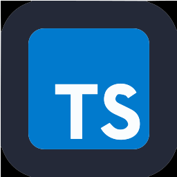
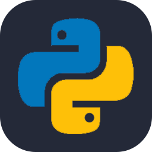
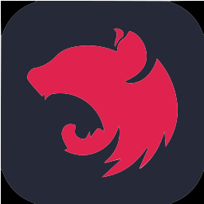
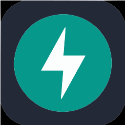
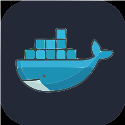

## Hi there 👋 I'm Yuval

<!--
**YuvalAnteby/YuvalAnteby** is a ✨ _special_ ✨ repository because its `README.md` (this file) appears on your GitHub profile.
-->

**Full-Stack developer** (React · NestJS / FastAPI) & **CS student @ Bar-Ilan University**.  
I like building practical, scalable projects with clean architecture.

 - 🔭 Currently building **Can You Run It?** — a game performance checker (FastAPI · React · MongoDB · Docker).
 - 🧪 I care about readable code, TDD when it helps, and solid PR hygiene.
 - 🤝 Open to collaborating on web backends, APIs, and performance-minded UIs.
 - ⚡ My hobbies: I love video games 🎮, and working out in the gym 🏋️‍♂️  
 - 📫 How to reach me: yuvala2001@gmail.com  

## :email: Find me on:  

 
  

  

---

## 📂 Selected Projects
- [**Can I Run It?**](https://github.com/YuvalAnteby/Can-I-Run-It) – Full-stack app that checks if a PC can run a game.  
  *Highlights:* FastAPI backend, React/MUI frontend, MongoDB, Docker.
- [**MailASP**](https://github.com/YuvalAnteby/Gmail-AdvancedSystemProgramming) – Gmail inspired mail system.  
  *Highlights:* Real time mail delivery, labels & sublabels, Android client, C++ Bloom Filter spam detection, Docker Compose, GitHub Actions CI.

---

## 🧰 My Tech Stack:

### Backend 

 
 
 
 
 
 

### Frontend & Mobile

 
 

### Tools & Infra
 

   
  

  
---

## :trophy: My Github Stats:

 

